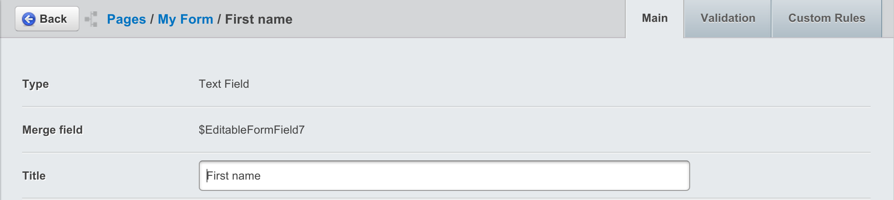
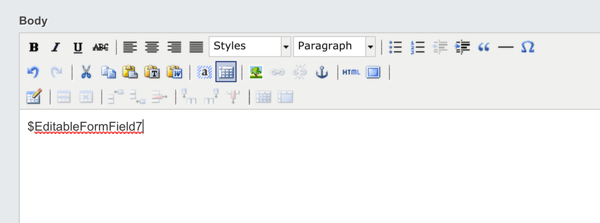

# User Documentation

In this section:

* Learn how to create and edit forms
* Learn how to add fields to a form
* Learn how to view submissions
* Learn how to set up automated emails upon form completion

## Before we begin:

* Make sure you are in the "Pages" section on the Navigation Tabs.

## Creating and editing forms

To create a new form, first decide where in the site you want your form to be. If you
would like your form to be a "subpage" of an already existing page, click on the
parent page in the left-hand Page Tree in the Contents Pane you would like to
create the subpage in. If you want your form to be in the top level navigation
for your site, you should click on the root of the site - the first item listed
in the Contents Pane.

On the top of the Contents Pane, you will find a button marked "Create." Click it, and a
drop-down menu will show up. Select "User Defined Form" Then hit the "Go" button.

You will notice that a new page has been created, with the name of "New UserDefinedForm."

Simply click on the new page in the content page to bring it up in the editing pane.

Don't worry if you create your page in the "wrong" place. Pages can be moved and re-ordered
easily, and we will cover that under "Managing Your Site."

 
## Combining forms and content

Much like editing any form page, you can add context, such as text or images, in the Main
section of the Contents tab on in the Editing Pane. Form pages are slightly different,
however. You will notice in a newly created form page, there is some text in the content
of the editing menu to begin with: "$UserDefinedForm"

The purpose of this little block of text is to tell the website where in the page you
would like to put the form. The form will appear on the website wherever the "$UserDefinedForm"
appears in the editing pane, whether it is before text, after text, inside a table, etc.

If $UserDefinedForm is deleted by accident or on purpose, SilverStripe automatically
puts the form at the end of all the content.

## Adding fields

To add a field to the form, click on the "Form Fields" in the Editing Pane. Click the "Add Field" button then select the type of field you want from the dropdown.
Save or publish the form to start editing your new field's properties.

### Field types

#### Checkbox Field 

Selecting a checkbox field adds a single checkbox to a form, along with a place to
store a label for that checkbox. This is useful for getting information that has a
"Yes or No" answer, such as "Would you like to be contacted?" or "Have you
understood the Terms and Conditions?"

Marking this field as required will require it to be checked.

#### Checkbox Group

Selecting a checkbox group adds a field for multiple checkboxes to a form, along with a
place to store a label for the group. This is useful for getting information that has
multiple discrete answers, such as "Which continents have you visited?" or "Which
software programs do you use on a daily basis?" You will need to click on the "Show
options" link to add user-selectable options.

Marking this field as required will require at least one option to be checked.

#### Country Dropdown

A list of all countries drawn from the internal list of known countries.

#### Date Field

Selecting a date field adds a field for a date in a form. The time of day is not selectable, however.

If your theme enables it, a date picker popup will be displayed to the user on the frontend.

#### Dropdown Field

Selecting a drop-down field adds a dropdown field to a form. This is useful for getting
information that has only one answer among several discrete choices, for example,
"Which region do you live in?" or "What subject is your question about?" You will
need to click on the "Show options" link to add user-selectable options.

#### Email Field

Selecting an Email field adds a textbox where an email address can be entered. Using the Email
field, instead of a normal text field, to store email addresses, allows you to use that email
address in many automated tasks. For example, it allows the CMS to send reply email
automatically when a form is filled out.

#### File Upload Field

Selecting a File Upload Field adds a field where users can upload a file from their
computers. This is useful for getting documents and media files.

The folder that this field uploads to can be customised by selecting "Show Options"
and then selecting a new folder from the "Select upload folder" option. If no folder
is selected it will upload by default to the "Uploads" folder.

Only certain file extensions are considered safe for upload,
e.g. webserver script files will be denied but images will be allowed.
The webserver environment also imposes a limit on file size by default.

#### Heading

Selecting a Heading allows adds a place where you can put a heading for a form, or for
a section of your form. You can choose which level of heading to use (from 1-6) from
the "Show options" link.

If you do not check the "Hide from reports" checkbox then this field will be displayed
in submission reports.

#### HTML Block

Selecting an HTML block allows you to add any HTML code you wish into your form.
You can edit the HTML blog from the "Show options" link.

If you do not check the "Hide from reports" checkbox then this field will be displayed
in submission reports.

Note: Take care not to allow input from unauthorised sources or users, as custom script
or code could be injected into your form.

#### Member List Field

Selecting a Member List Field adds a dropdown field which includes various groups of website
members (such as administrators or forum members) to the form. You can choose which group
of members from the "Show Options" link.

Note: Take care that you do not expose confidential or personal information about your CMS
or front end users as these names will become publicly visible.

#### Numeric Field

A basic text field that will only accept numeric values (numbers and decimals only).

#### Radio Field

Selecting a Radio field adds a field filed with "Radio button" options to a form.
Radio buttons are similar to checkboxes, except that only one button in a radio
field can be checked at a time. This is useful for getting information that has
only one answer among several discrete choices, for example, "What country do
you live in?" or "What subject is your question about?" It is similar to a
dropdown field, but it is more useful for providing larger labels to responses.
For example, a dropdown field may have one or two-word inputs, while a radio
button may have choices that are paragraphs in length. You will need to click
on the "Show options" link to add user-selectable options.

#### Text Field

Selecting a Text field adds a text field to the form. You can click on "Show options"
to determine the size and the number of rows in a text field.

**Put another way, if you'd like to create a question that...**

* Has a yes or no answer - use [Checkbox Field](#checkbox-field). 
* Has multiple possible answers, from a list of choices - use [Checkbox Group](#checkbox-group).
* Has one answer, from a list of choices - use [Dropdown Field](#dropdown-field) (for short answers) or
  [Radio Field](#radio-field) (for longer answers).
* Requires a written answer - use [Text Field](#text-field).

**Or perhaps you'd like to add informational content to your form?**

* Use [HTML Block](#html-block), with the appropriate level [Heading](#heading).

## Creating a multi-page form

To create a multi-page form, simply click the 'Add Page Break' button. 
This will create a page break field which is used to create a new page in the form. You can drag and drop this page break to separate form fields at the desired location.

## Adding fieldgroups 

Creating fieldgroups is as simple as clicking the 'Add fieldgroup' button, this create two 'markers' which act as the beginning/end for the fieldgroup. Any fields place between these two markers will be automatically included within the fieldgroup.

## Viewing form submissions

To view form submissions navigate to the 'Submissions' tab. You can click any of the listed submissions to view the content of each submission.

## Setting up automated emails

It is possible to set up automated emails upon each form submission, to do this navigate to the "Recipients" tab and click "Add Email Recipient".

You will be prompted with a form where you can fill in the details of the email.

### Using form fields in submission emails

Each form field has a unique merge field located under the field's options.

Simply insert the merge field into the email content, and the field's value will be displayed, when the email is sent.

### Email details

#### Email Subject

The subject of the email, you can either type a custom subject here or select a field from the form to use as the email subject.

#### Send email to

This is the recipient's address where the email will be sent.

#### Send email from

This shows where the email was sent from, and will most likely need to be an email address on the same domain as your site. For example If your website is yoursite.com, the email address for this field should be something@yoursite.com.

#### Email for reply to

This will be the address which the email recipient will be able to 'reply' to.

#### Email content

In this field you can add a custom message to add to the email

#### Hide form data from email?

You can check this if you do not wish for the email recipient to see the form submission's data in the email.

#### Send email as plain text?

You can check this if you want to remove all of the HTML from the email, this means the email
will have no custom styling and the recipient will only see the plain text.

If `Send email as plain text?` is unselected, several additional options for HTML editing are displayed.

If sending as HTML, there is the option to preview the HTML that is sent in the editor. Additionally, a HTML
template can be selected to provide a standard formatted email to contain the editable HTML content.

The list of available templates can be controlled by specifying the folder for these template files in yaml config.

	:::yaml
	UserDefinedForm:
	  email_template_directory: mysite/templates/useremails/

### Custom Rules

In this section you can determine whether to send the email to the recipient based on the data in the form submission.

#### Send conditions

This decides whether to send the email based on two options

1. *All* conditions are true (Every single custom rule must be met in order to send the email)
2. *Any* conditions are true (At least one of the custom rules must be met in order to send the email)

#### Adding a custom rule

* Click 'Add' to add a custom sending rule.
* Select the field which you want the custom rule to apply to
* Select the condition the field must follow
* enter for the condition (the 'is blank' and 'is not blank' conditions do not require any text)

## Configuration

The 'Configuration' tab has a number of options used for customising your form's behaviour and appearance.

### Validation messages

Validation messages are displayed below invalid fields by default. By checking the 'Display error messages above the form'
option, an additional set of validation messages are displayed, at the top of the form.

When a user submits an invalid form, they are directed to the top of the form, where they can review the messages.
Each message links to it's corresponding field so users can easily make the required changes.
