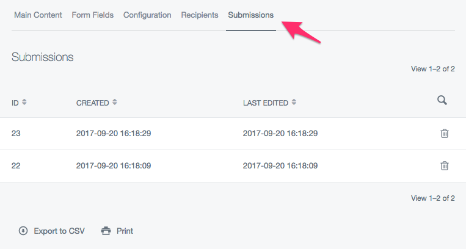
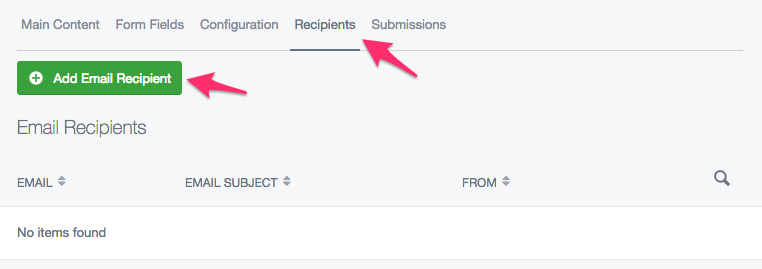
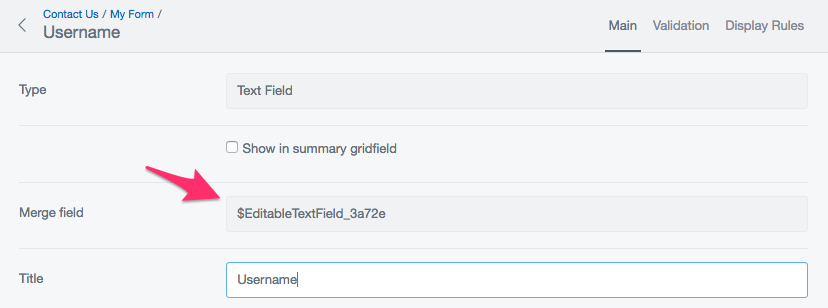
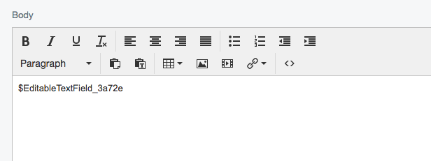
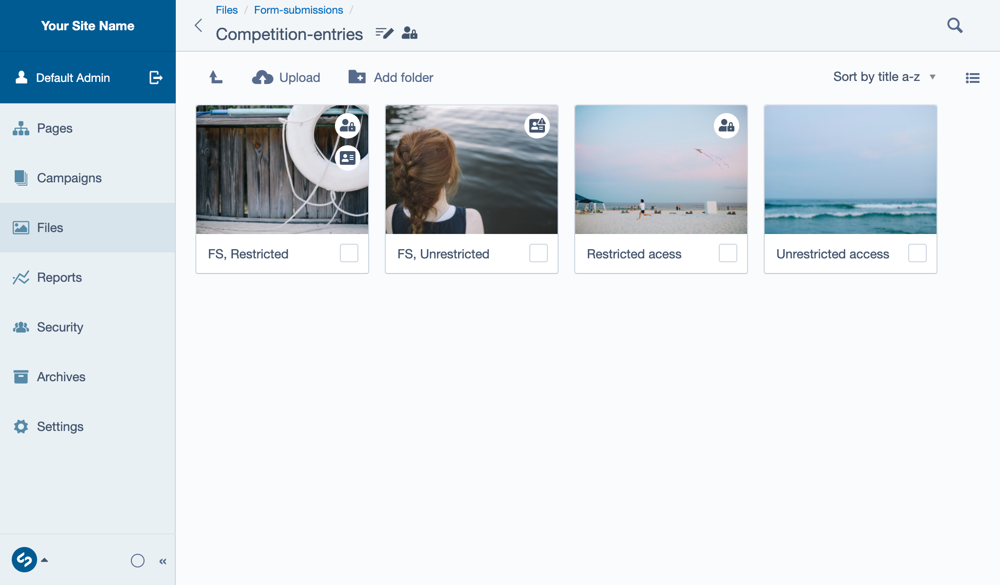
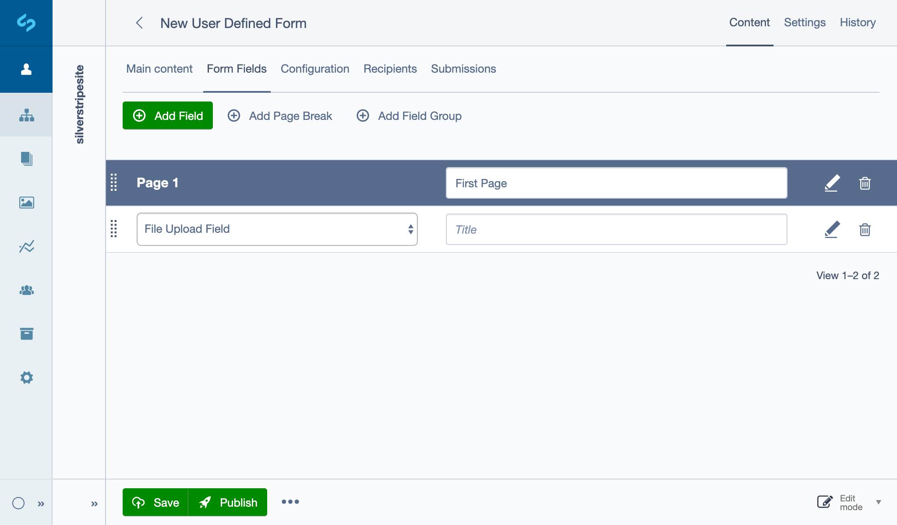
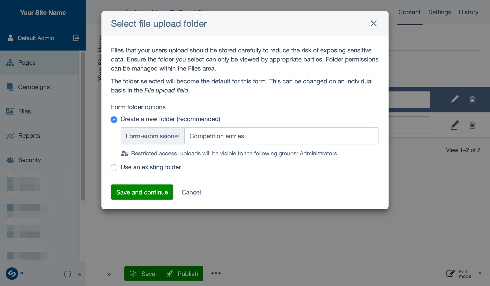
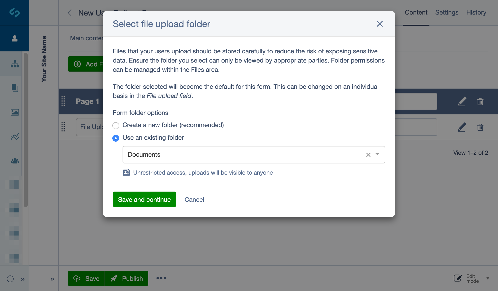
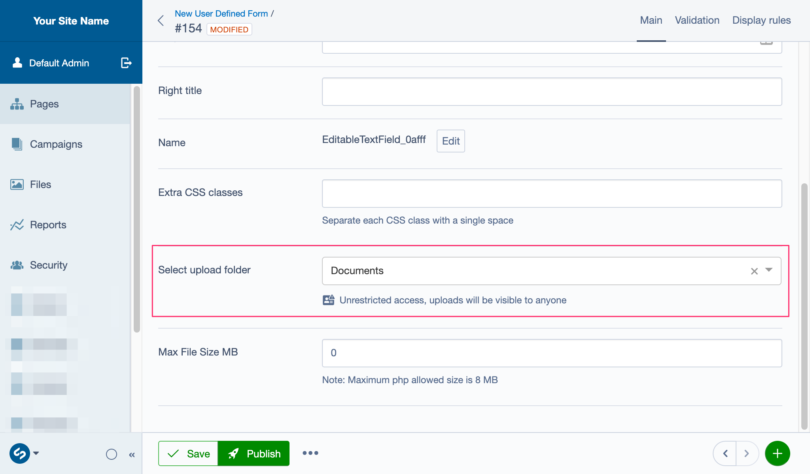

# Form submissions

## Viewing form submissions in the CMS

To view form submissions navigate to the 'Submissions' tab. You can click any of the listed submissions to view the content of each submission.



## Setting up automated emails for submissions

It is possible to set up automated emails upon each form submission, to do this navigate to the "Recipients" tab and click "Add Email Recipient".



You will be prompted with a form where you can fill in the details of the email.

### Using form fields in submission emails

Each form field has a unique merge field located under the field's options.



Simply insert the merge field into the email content, and the field's value will be displayed, when the email is sent.



### Email details

#### Email subject

The subject of the email, you can either type a custom subject here or select a field from the form to use as the email subject.

#### Send email to

This is the recipient's address where the email will be sent.

#### Send email from

This shows where the email was sent from, and will most likely need to be an email address on the same domain as your site. For example If your website is `example.com`, the email address for this field should be `something@example.com`.

#### Email for reply to

This will be the address which the email recipient will be able to 'reply' to.

#### Email content

In this field you can add a custom message to add to the email

#### Hide form data from email?

You can check this if you do not wish for the email recipient to see the form submission's data in the email.

#### Hide invisible fields from email?

You can check this if you want to hide the fields from the email that were invisible to the user according to the display rules set up for the form fields.

#### Send email as plain text?

You can check this if you want to remove all of the HTML from the email, this means the email
will have no custom styling and the recipient will only see the plain text.

If "Send email as plain text?" is unselected, several additional options for HTML editing are displayed.

If sending as HTML, there is the option to preview the HTML that is sent in the editor. Additionally an HTML
template can be selected to provide a standard formatted email to contain the editable HTML content.

The list of available templates can be controlled by specifying the folder for these template files in YAML config.

```yml
UserDefinedForm:
  email_template_directory: mysite/templates/useremails/
```

### Custom rules

In this section you can determine whether to send the email to the recipient based on the data in the form submission.

#### Send conditions

This decides whether to send the email based on two options

1. *All* conditions are true (Every single custom rule must be met in order to send the email)
1. *Any* conditions are true (At least one of the custom rules must be met in order to send the email)

#### Adding a custom rule

- Click 'Add' to add a custom sending rule.
- Select the field which you want the custom rule to apply to
- Select the condition the field must follow
- enter for the condition (the 'is blank' and 'is not blank' conditions do not require any text)

## File upload field

> [!NOTE]
> This functionality is specifically included in Silverstripe core functionality 4.6 and above,
> [silverstripe-userforms](https://github.com/silverstripe/silverstripe-userforms/) 5.3 and above and is also included in
> the module [silverstripe-elemental-userforms](https://github.com/dnadesign/silverstripe-elemental-userforms).

Files and other data that is uploaded by your website visitors should be handled with care to reduce the risk of exposing sensitive data.
Files which are uploaded through a form inherit the permissions of the folder they are being placed into, so it's important that you
ensure the folder you select can only be viewed by appropriate parties. Folder permissions can be managed within the Files area.

File permissions do not affect the Draft/Modified/Published state of files. Use both file permissions and Draft states
together to ensure your files remain safe. For example, in case they are accidentally published.

## File indicators

Files have a number of icons which can help to identify the original source of a file and whether caution should be taken when using it.

**Form submission:** 

This indicates a file is associated with a form submission. This file has not been uploaded to the CMS by a Content Manager and may contain sensitive information. Care should be taken so that it is not published and leaked.

**Form submission with warning:** 

This indicates that a file associated with a form submission does not have the recommended permissions applied to it.
A caution symbol is added to the form submission icon because it has a higher risk of being publicly accessible if it is published.

**Restricted access:** 

Indicates that a file/folder has restricted access and will only be visible to certain users or groups. To learn more about the usage of this particular icon refer to
[File Permissions](https://userhelp.silverstripe.org/en/creating_pages_and_content/creating_and_editing_content/images_and_documents/file_permissions).

## Overview of files with custom permissions



> [!NOTE]
> Folder with restricted access containing files with custom permissions and their associated file icons.
>
> - FS - Form submission

To get started, create a new **User Defined Form** page in the CMS. See [Creating and editing forms](creating-and-editing-forms)
to learn more. To add a File Upload field to the form, click on the ***Form Fields*** tab in the page editing view.
Click the ***Add Field*** button then select **File Upload Field** from the dropdown.



### Setting up a folder to store file uploads for your form

When setting up an Upload Field on a form for the first time you will receive a prompt to select an appropriate folder to store files for this form.
You can either create a new folder or use an existing folder to store your file submissions.

The folder you select will become the default folder for this form and any additional Upload Fields which are added.
Each File Upload Field can use different folders for storing its files, this can be managed by editing the folder location on each individual field.

#### Option 1, create a new folder (recommended)

This option is only available the first time you add an upload field to your form. Once the first upload folder for the form has been established,
all subsequent file uploads from the same form will use this folder by default.

By default this option will store file submissions in a folder with restricted access suitable for dealing with personal/sensitive data.
A folder will automatically be created with the same name as the form name.

It will be recommended for this folder (and the submission files) to be placed within a top level folder named ‘/Form-submissions’.
You can either use the suggested folder name or create your own by altering the folder name. You can also manually add deeper folder levels
 by adding ‘/’ in the text field provided e.g ‘Competition-entries/May-2020’.

By default the ‘/Form-submissions’ folder is set so only [Admins](https://userhelp.silverstripe.org/en/managing_your_website/managing_roles_and_permissions/#using-roles)
have permissions to access it (restricted access), any files or folders in this folder will inherit these permissions.
This can be changed manually on a per file/folder basis from the **Files** area.

Click **Save and continue** to continue editing your form.



#### Option 2, use an existing folder

If you choose to use a folder that already exists you can select the folder from the **Select folder** dropdown. Once you select a folder,
an icon will indicate whether or not the folder has restricted access and provide information for who the file uploads will be visible to.

If the form deals with personal data you will want to select a folder which has Restricted Access.
It will display some information about the groups who can access files in this folder.

Click **Save and continue** to continue editing your form.



## Changing folders for individual fields

If the folder you have selected for storing files does not have the recommended view restrictions applied, files uploaded to that folder
which have a published state will be visible to anyone who views them, or that can guess the URL.
You can change the folder associated with an Upload Field at any time.



When viewing/selecting folder locations from the form you will see an icon indicating its permission status.
You will either see a **restricted access** icon, or a **warning** icon.

To store your files in a safer manor you can do one of several things:

- Create a new folder from the Files area, or if this is your first time setting up an Upload Field for this form you will be guided through the process, for more information see [Setting up a folder to store file uploads for your form](#setting-up-a-folder-to-store-file-uploads-for-your-form).
- Change the upload folder to one which already has restricted access. Edit the Upload Field and select a folder from the **Select a folder** dropdown.
- Change the view access permissions of the current folder in the Files area to restrict access to the file.

You can manage your folder permissions by navigating to the Files section in the CMS menu and edit the folders details.
See [File Permissions](https://userhelp.silverstripe.org/en/creating_pages_and_content/creating_and_editing_content/images_and_documents/file_permissions)
for more information and [Roles and permissions](https://userhelp.silverstripe.org/en/managing_your_website/managing_roles_and_permissions/) to learn more.

For more information on the usage of these icons in the files area, please refer to [File Indicators](https://userhelp.silverstripe.org/en/creating_pages_and_content/creating_and_editing_content/images_and_documents/file_permissions/#file-indicators).
