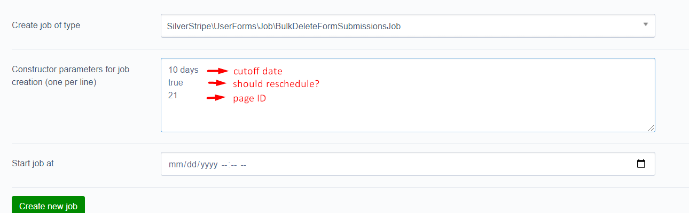

# Bulk delete form submissions

Allow users to delete form submissions using the Silverstripe queuedjobs module.

## Important note

- Running either jobs will result in lost of data and/or physical files. Please ensure you have created a backup of your
site.

## How to use
- Visit the `Jobs` section in the CMS to create these jobs
- Select the job type using the "Create job of type" dropdown field.
- Select the job to run (`BulkDeleteFormSubmissionsJob`) to run and supply the "parameters" on the text area provided. Please note that each parameter can only occupy a single line on the text area box. 
    
    Example:
    * `10 days` cutoff date. All form submissions older than this will be deleted. Leave this blank and the job will use the `default_cutoff_date` (30 days).
    * `true` reschedule option. If `true`, job will be rescheduled based on `default_new_schedule` setting (defaults to 1 day) and will reuse the cutoff date specified. Setting to `false` will run the job once.
    * `21` userform ID. The `ParentID` value of the `SubmittedForm`. If blank, all SubmittedForm records will be deleted based on the cutoff date. 

