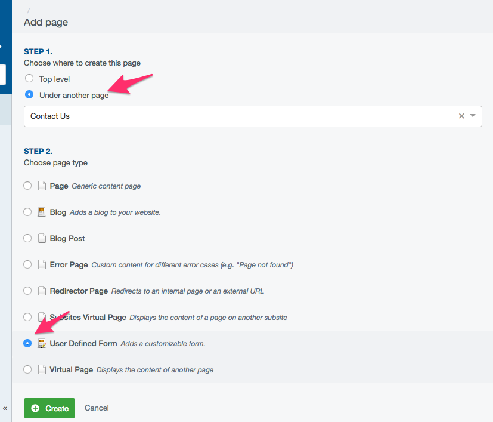
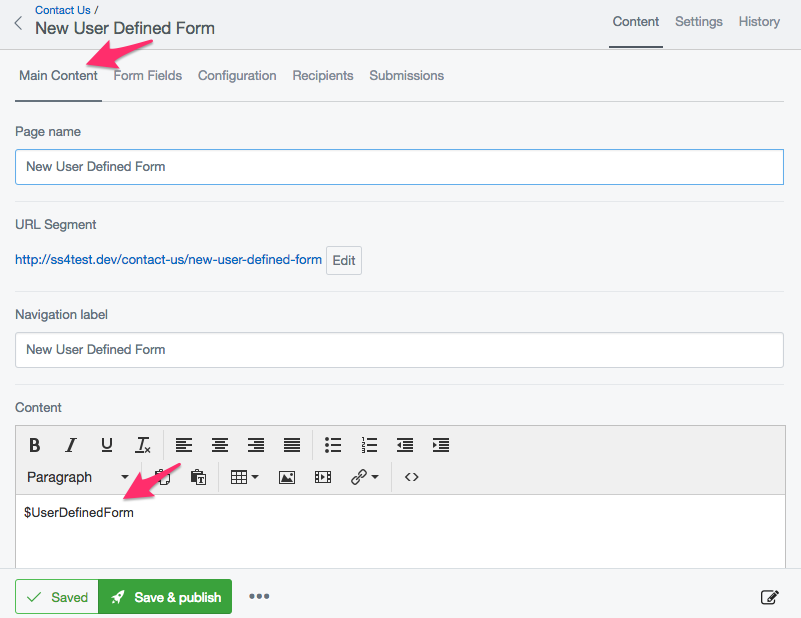
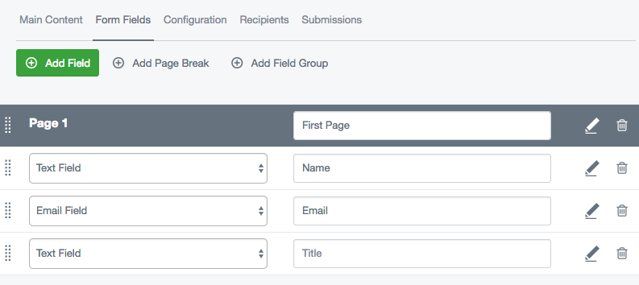
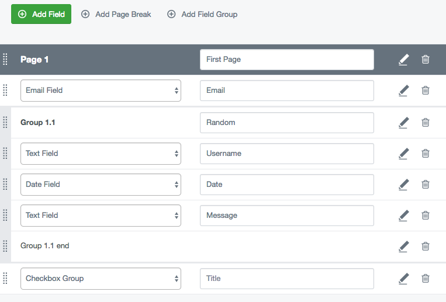
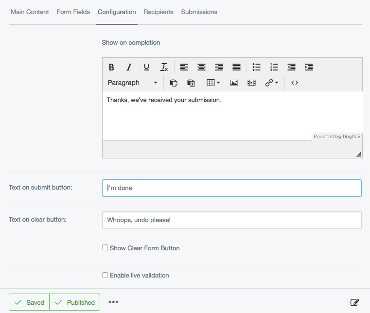

# Creating and editing forms

To create a new form, first decide where in the site you want your form to be. If you
would like your form to be a "subpage" of an already existing page, click on the
parent page in the left-hand Page Tree in the Contents Pane you would like to
create the subpage in. If you want your form to be in the top level navigation
for your site, you should click on the root of the site - the first item listed
in the Contents Pane.

On the top of the Contents Pane, you will find a button marked "Create." Click it, and a
drop-down menu will show up. Select "User Defined Form" Then hit the "Go" button.

You will notice that a new page has been created, with the name of "New UserDefinedForm."

Click on the new page in the content page to bring it up in the editing pane.

Don't worry if you create your page in the "wrong" place. Pages can be moved and re-ordered
easily, and we will cover that under "Managing Your Site."

 
## Combining forms and content

Much like editing any form page, you can add context, such as text or images, in the Main
section of the Contents tab on in the Editing Pane. Form pages are slightly different,
however. You will notice in a newly created form page, there is some text in the content
of the editing menu to begin with: "$UserDefinedForm"

The purpose of this little block of text is to tell the website where in the page you
would like to put the form. The form will appear on the website wherever the "$UserDefinedForm"
appears in the editing pane, whether it is before text, after text, inside a table, etc.

If $UserDefinedForm is deleted by accident or on purpose, SilverStripe automatically
puts the form at the end of all the content.

## Adding fields

To add a field to the form, click on the "Form Fields" in the Editing Pane. Click the "Add Field" button then select the type of field you want from the dropdown.
Save or publish the form to start editing your new field's properties.

To get details of the available form fields and what they do see [form field type documentation](field-types.md)

## Adding fieldgroups 

Creating fieldgroups is as simple as clicking the 'Add fieldgroup' button, this create two 'markers' which act as the beginning/end for the fieldgroup. Any fields place between these two markers will be automatically included within the fieldgroup.

## Validation messages

Validation messages are displayed below invalid fields by default. By checking the 'Display error messages above the form'
option, an additional set of validation messages are displayed, at the top of the form.

When a user submits an invalid form, they are directed to the top of the form, where they can review the messages.
Each message links to it's corresponding field so users can easily make the required changes.

## Configuration

The 'Configuration' tab has a number of options used for customising your form's behaviour and appearance.

