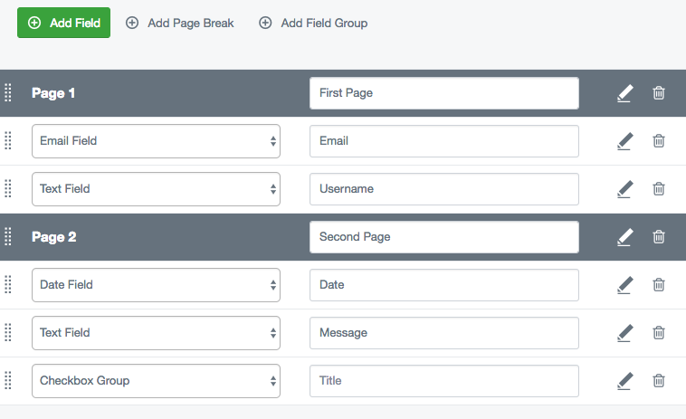

## Creating a multi-page form

To create a multi-page form, simply click the 'Add Page Break' button. 
This will create a page break field which is used to create a new page in the form. You can drag and drop this page break to separate form fields at the desired location.

